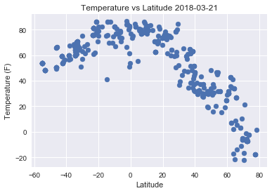
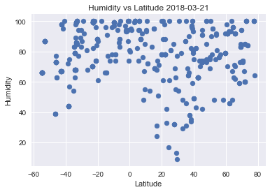
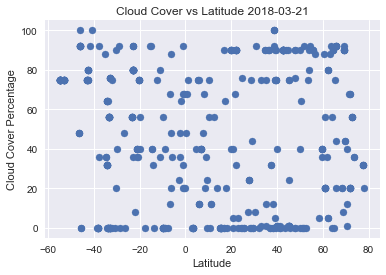
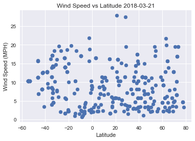

# Observations
* Temperature seems to drop as the absolute value of the latitude gets larger
* Cloudiness and Wind Speed do not appear to have any significant correlation with Latitude
* Cities near the equator tend to have a higher baseline humidity than more polar cities.


```python
import random 
import matplotlib.pyplot as plt
import pandas as pd
from citipy import citipy
import requests
import datetime
import seaborn as sns
```


```python
#Create 500 Random Coordinates
coordinate=[]
for i in range(500):
    a=random.randint(-90,90)
    b=random.randint(-180,180)
    coordinate.append((a,b))
```


```python
#Find City Near the 500 Coordinates
cities = []
for coordinate_pair in coordinate:
    lat, lon = coordinate_pair
    cities.append(citipy.nearest_city(lat, lon))
```


```python
#Find The City Names
citynames=[]
for city in cities:
    citynames.append(city.city_name)
```


```python
#Building URL
url = "http://api.openweathermap.org/data/2.5/weather?"
units = "imperial"
api_key="f8a169f17a1b4378d9a005fa7defdb39"
query_url = f"{url}appid={api_key}&units={units}&q="
```


```python
#Finding Data
temp=[]
lat=[]
humid=[]
cloud=[]
wind=[]
names=[]
for i in range(len(citynames)):
    try:
        name=cities[i].city_name
        query=query_url + citynames[i]
        current_weather=requests.get(query, timeout=30).json()
        lat.append(current_weather['coord']['lat'])
        temp.append(current_weather['main']['temp'])
        humid.append(current_weather['main']['humidity'])
        cloud.append(current_weather['clouds']['all'])
        wind.append(current_weather['wind']['speed'])
        names.append(name)
        print(f'Processing City #{i+1}. ' + f'City name:{name}')
        print(query)
    except KeyError:
        print(f'{name} not found')
        print(query)
```

    Processing City #1. City name:saint-philippe
    http://api.openweathermap.org/data/2.5/weather?appid=f8a169f17a1b4378d9a005fa7defdb39&units=imperial&q=saint-philippe
    Processing City #2. City name:kodiak
    http://api.openweathermap.org/data/2.5/weather?appid=f8a169f17a1b4378d9a005fa7defdb39&units=imperial&q=kodiak
    Processing City #3. City name:georgetown
    http://api.openweathermap.org/data/2.5/weather?appid=f8a169f17a1b4378d9a005fa7defdb39&units=imperial&q=georgetown
    Processing City #4. City name:atuona
    http://api.openweathermap.org/data/2.5/weather?appid=f8a169f17a1b4378d9a005fa7defdb39&units=imperial&q=atuona
    Processing City #5. City name:butaritari
    http://api.openweathermap.org/data/2.5/weather?appid=f8a169f17a1b4378d9a005fa7defdb39&units=imperial&q=butaritari
    illoqqortoormiut not found
    http://api.openweathermap.org/data/2.5/weather?appid=f8a169f17a1b4378d9a005fa7defdb39&units=imperial&q=illoqqortoormiut
    Processing City #7. City name:punta arenas
    http://api.openweathermap.org/data/2.5/weather?appid=f8a169f17a1b4378d9a005fa7defdb39&units=imperial&q=punta arenas
    Processing City #8. City name:mataura
    http://api.openweathermap.org/data/2.5/weather?appid=f8a169f17a1b4378d9a005fa7defdb39&units=imperial&q=mataura
    Processing City #9. City name:sao geraldo do araguaia
    http://api.openweathermap.org/data/2.5/weather?appid=f8a169f17a1b4378d9a005fa7defdb39&units=imperial&q=sao geraldo do araguaia
    Processing City #10. City name:jamestown
    http://api.openweathermap.org/data/2.5/weather?appid=f8a169f17a1b4378d9a005fa7defdb39&units=imperial&q=jamestown
    Processing City #11. City name:port alfred
    http://api.openweathermap.org/data/2.5/weather?appid=f8a169f17a1b4378d9a005fa7defdb39&units=imperial&q=port alfred
    taolanaro not found
    http://api.openweathermap.org/data/2.5/weather?appid=f8a169f17a1b4378d9a005fa7defdb39&units=imperial&q=taolanaro
    Processing City #13. City name:diamantino
    http://api.openweathermap.org/data/2.5/weather?appid=f8a169f17a1b4378d9a005fa7defdb39&units=imperial&q=diamantino
    Processing City #14. City name:mataura
    http://api.openweathermap.org/data/2.5/weather?appid=f8a169f17a1b4378d9a005fa7defdb39&units=imperial&q=mataura
    Processing City #15. City name:busselton
    http://api.openweathermap.org/data/2.5/weather?appid=f8a169f17a1b4378d9a005fa7defdb39&units=imperial&q=busselton
    Processing City #16. City name:hambantota
    http://api.openweathermap.org/data/2.5/weather?appid=f8a169f17a1b4378d9a005fa7defdb39&units=imperial&q=hambantota
    Processing City #17. City name:rikitea
    http://api.openweathermap.org/data/2.5/weather?appid=f8a169f17a1b4378d9a005fa7defdb39&units=imperial&q=rikitea
    Processing City #18. City name:la orilla
    http://api.openweathermap.org/data/2.5/weather?appid=f8a169f17a1b4378d9a005fa7defdb39&units=imperial&q=la orilla
    Processing City #19. City name:cidreira
    http://api.openweathermap.org/data/2.5/weather?appid=f8a169f17a1b4378d9a005fa7defdb39&units=imperial&q=cidreira
    Processing City #20. City name:raudeberg
    http://api.openweathermap.org/data/2.5/weather?appid=f8a169f17a1b4378d9a005fa7defdb39&units=imperial&q=raudeberg
    Processing City #21. City name:mataura
    http://api.openweathermap.org/data/2.5/weather?appid=f8a169f17a1b4378d9a005fa7defdb39&units=imperial&q=mataura
    Processing City #22. City name:bethel
    http://api.openweathermap.org/data/2.5/weather?appid=f8a169f17a1b4378d9a005fa7defdb39&units=imperial&q=bethel
    Processing City #23. City name:airai
    http://api.openweathermap.org/data/2.5/weather?appid=f8a169f17a1b4378d9a005fa7defdb39&units=imperial&q=airai
    Processing City #24. City name:arraial do cabo
    http://api.openweathermap.org/data/2.5/weather?appid=f8a169f17a1b4378d9a005fa7defdb39&units=imperial&q=arraial do cabo
    Processing City #25. City name:vestmannaeyjar
    http://api.openweathermap.org/data/2.5/weather?appid=f8a169f17a1b4378d9a005fa7defdb39&units=imperial&q=vestmannaeyjar
    Processing City #26. City name:port alfred
    http://api.openweathermap.org/data/2.5/weather?appid=f8a169f17a1b4378d9a005fa7defdb39&units=imperial&q=port alfred
    Processing City #27. City name:charters towers
    http://api.openweathermap.org/data/2.5/weather?appid=f8a169f17a1b4378d9a005fa7defdb39&units=imperial&q=charters towers
    Processing City #28. City name:khatanga
    http://api.openweathermap.org/data/2.5/weather?appid=f8a169f17a1b4378d9a005fa7defdb39&units=imperial&q=khatanga
    Processing City #29. City name:saurimo
    http://api.openweathermap.org/data/2.5/weather?appid=f8a169f17a1b4378d9a005fa7defdb39&units=imperial&q=saurimo
    Processing City #30. City name:mahebourg
    http://api.openweathermap.org/data/2.5/weather?appid=f8a169f17a1b4378d9a005fa7defdb39&units=imperial&q=mahebourg
    Processing City #31. City name:atbasar
    http://api.openweathermap.org/data/2.5/weather?appid=f8a169f17a1b4378d9a005fa7defdb39&units=imperial&q=atbasar
    Processing City #32. City name:barrow
    http://api.openweathermap.org/data/2.5/weather?appid=f8a169f17a1b4378d9a005fa7defdb39&units=imperial&q=barrow
    Processing City #33. City name:lagoa
    http://api.openweathermap.org/data/2.5/weather?appid=f8a169f17a1b4378d9a005fa7defdb39&units=imperial&q=lagoa
    Processing City #34. City name:puerto ayora
    http://api.openweathermap.org/data/2.5/weather?appid=f8a169f17a1b4378d9a005fa7defdb39&units=imperial&q=puerto ayora
    Processing City #35. City name:port elizabeth
    http://api.openweathermap.org/data/2.5/weather?appid=f8a169f17a1b4378d9a005fa7defdb39&units=imperial&q=port elizabeth
    Processing City #36. City name:bozuyuk
    http://api.openweathermap.org/data/2.5/weather?appid=f8a169f17a1b4378d9a005fa7defdb39&units=imperial&q=bozuyuk
    Processing City #37. City name:tura
    http://api.openweathermap.org/data/2.5/weather?appid=f8a169f17a1b4378d9a005fa7defdb39&units=imperial&q=tura
    Processing City #38. City name:vardo
    http://api.openweathermap.org/data/2.5/weather?appid=f8a169f17a1b4378d9a005fa7defdb39&units=imperial&q=vardo
    Processing City #39. City name:bambous virieux
    http://api.openweathermap.org/data/2.5/weather?appid=f8a169f17a1b4378d9a005fa7defdb39&units=imperial&q=bambous virieux
    Processing City #40. City name:georgetown
    http://api.openweathermap.org/data/2.5/weather?appid=f8a169f17a1b4378d9a005fa7defdb39&units=imperial&q=georgetown
    Processing City #41. City name:rikitea
    http://api.openweathermap.org/data/2.5/weather?appid=f8a169f17a1b4378d9a005fa7defdb39&units=imperial&q=rikitea
    Processing City #42. City name:saint-philippe
    http://api.openweathermap.org/data/2.5/weather?appid=f8a169f17a1b4378d9a005fa7defdb39&units=imperial&q=saint-philippe
    Processing City #43. City name:mataura
    http://api.openweathermap.org/data/2.5/weather?appid=f8a169f17a1b4378d9a005fa7defdb39&units=imperial&q=mataura
    Processing City #44. City name:altay
    http://api.openweathermap.org/data/2.5/weather?appid=f8a169f17a1b4378d9a005fa7defdb39&units=imperial&q=altay
    barentsburg not found
    http://api.openweathermap.org/data/2.5/weather?appid=f8a169f17a1b4378d9a005fa7defdb39&units=imperial&q=barentsburg
    Processing City #46. City name:bredasdorp
    http://api.openweathermap.org/data/2.5/weather?appid=f8a169f17a1b4378d9a005fa7defdb39&units=imperial&q=bredasdorp
    Processing City #47. City name:guerrero negro
    http://api.openweathermap.org/data/2.5/weather?appid=f8a169f17a1b4378d9a005fa7defdb39&units=imperial&q=guerrero negro
    Processing City #48. City name:esperance
    http://api.openweathermap.org/data/2.5/weather?appid=f8a169f17a1b4378d9a005fa7defdb39&units=imperial&q=esperance
    Processing City #49. City name:klaksvik
    http://api.openweathermap.org/data/2.5/weather?appid=f8a169f17a1b4378d9a005fa7defdb39&units=imperial&q=klaksvik
    Processing City #50. City name:georgetown
    http://api.openweathermap.org/data/2.5/weather?appid=f8a169f17a1b4378d9a005fa7defdb39&units=imperial&q=georgetown
    Processing City #51. City name:vuktyl
    http://api.openweathermap.org/data/2.5/weather?appid=f8a169f17a1b4378d9a005fa7defdb39&units=imperial&q=vuktyl
    Processing City #52. City name:saldanha
    http://api.openweathermap.org/data/2.5/weather?appid=f8a169f17a1b4378d9a005fa7defdb39&units=imperial&q=saldanha
    amderma not found
    http://api.openweathermap.org/data/2.5/weather?appid=f8a169f17a1b4378d9a005fa7defdb39&units=imperial&q=amderma
    Processing City #54. City name:pevek
    http://api.openweathermap.org/data/2.5/weather?appid=f8a169f17a1b4378d9a005fa7defdb39&units=imperial&q=pevek
    Processing City #55. City name:ushuaia
    http://api.openweathermap.org/data/2.5/weather?appid=f8a169f17a1b4378d9a005fa7defdb39&units=imperial&q=ushuaia
    Processing City #56. City name:lata
    http://api.openweathermap.org/data/2.5/weather?appid=f8a169f17a1b4378d9a005fa7defdb39&units=imperial&q=lata
    Processing City #57. City name:tasiilaq
    http://api.openweathermap.org/data/2.5/weather?appid=f8a169f17a1b4378d9a005fa7defdb39&units=imperial&q=tasiilaq
    Processing City #58. City name:tuktoyaktuk
    http://api.openweathermap.org/data/2.5/weather?appid=f8a169f17a1b4378d9a005fa7defdb39&units=imperial&q=tuktoyaktuk
    saleaula not found
    http://api.openweathermap.org/data/2.5/weather?appid=f8a169f17a1b4378d9a005fa7defdb39&units=imperial&q=saleaula
    Processing City #60. City name:souillac
    http://api.openweathermap.org/data/2.5/weather?appid=f8a169f17a1b4378d9a005fa7defdb39&units=imperial&q=souillac
    Processing City #61. City name:barrow
    http://api.openweathermap.org/data/2.5/weather?appid=f8a169f17a1b4378d9a005fa7defdb39&units=imperial&q=barrow
    samusu not found
    http://api.openweathermap.org/data/2.5/weather?appid=f8a169f17a1b4378d9a005fa7defdb39&units=imperial&q=samusu
    Processing City #63. City name:sangar
    http://api.openweathermap.org/data/2.5/weather?appid=f8a169f17a1b4378d9a005fa7defdb39&units=imperial&q=sangar
    belushya guba not found
    http://api.openweathermap.org/data/2.5/weather?appid=f8a169f17a1b4378d9a005fa7defdb39&units=imperial&q=belushya guba
    Processing City #65. City name:punta arenas
    http://api.openweathermap.org/data/2.5/weather?appid=f8a169f17a1b4378d9a005fa7defdb39&units=imperial&q=punta arenas
    Processing City #66. City name:sao filipe
    http://api.openweathermap.org/data/2.5/weather?appid=f8a169f17a1b4378d9a005fa7defdb39&units=imperial&q=sao filipe
    Processing City #67. City name:khatanga
    http://api.openweathermap.org/data/2.5/weather?appid=f8a169f17a1b4378d9a005fa7defdb39&units=imperial&q=khatanga
    Processing City #68. City name:atuona
    http://api.openweathermap.org/data/2.5/weather?appid=f8a169f17a1b4378d9a005fa7defdb39&units=imperial&q=atuona
    kapoeta not found
    http://api.openweathermap.org/data/2.5/weather?appid=f8a169f17a1b4378d9a005fa7defdb39&units=imperial&q=kapoeta
    Processing City #70. City name:ushuaia
    http://api.openweathermap.org/data/2.5/weather?appid=f8a169f17a1b4378d9a005fa7defdb39&units=imperial&q=ushuaia
    Processing City #71. City name:ushuaia
    http://api.openweathermap.org/data/2.5/weather?appid=f8a169f17a1b4378d9a005fa7defdb39&units=imperial&q=ushuaia
    Processing City #72. City name:kudahuvadhoo
    http://api.openweathermap.org/data/2.5/weather?appid=f8a169f17a1b4378d9a005fa7defdb39&units=imperial&q=kudahuvadhoo
    Processing City #73. City name:hobart
    http://api.openweathermap.org/data/2.5/weather?appid=f8a169f17a1b4378d9a005fa7defdb39&units=imperial&q=hobart
    Processing City #74. City name:hobart
    http://api.openweathermap.org/data/2.5/weather?appid=f8a169f17a1b4378d9a005fa7defdb39&units=imperial&q=hobart
    Processing City #75. City name:ixtapa
    http://api.openweathermap.org/data/2.5/weather?appid=f8a169f17a1b4378d9a005fa7defdb39&units=imperial&q=ixtapa
    Processing City #76. City name:padang
    http://api.openweathermap.org/data/2.5/weather?appid=f8a169f17a1b4378d9a005fa7defdb39&units=imperial&q=padang
    Processing City #77. City name:fortuna
    http://api.openweathermap.org/data/2.5/weather?appid=f8a169f17a1b4378d9a005fa7defdb39&units=imperial&q=fortuna
    Processing City #78. City name:aykhal
    http://api.openweathermap.org/data/2.5/weather?appid=f8a169f17a1b4378d9a005fa7defdb39&units=imperial&q=aykhal
    Processing City #79. City name:kapaa
    http://api.openweathermap.org/data/2.5/weather?appid=f8a169f17a1b4378d9a005fa7defdb39&units=imperial&q=kapaa
    Processing City #80. City name:georgetown
    http://api.openweathermap.org/data/2.5/weather?appid=f8a169f17a1b4378d9a005fa7defdb39&units=imperial&q=georgetown
    barentsburg not found
    http://api.openweathermap.org/data/2.5/weather?appid=f8a169f17a1b4378d9a005fa7defdb39&units=imperial&q=barentsburg
    Processing City #82. City name:walvis bay
    http://api.openweathermap.org/data/2.5/weather?appid=f8a169f17a1b4378d9a005fa7defdb39&units=imperial&q=walvis bay
    Processing City #83. City name:cehegin
    http://api.openweathermap.org/data/2.5/weather?appid=f8a169f17a1b4378d9a005fa7defdb39&units=imperial&q=cehegin
    Processing City #84. City name:rikitea
    http://api.openweathermap.org/data/2.5/weather?appid=f8a169f17a1b4378d9a005fa7defdb39&units=imperial&q=rikitea
    Processing City #85. City name:avarua
    http://api.openweathermap.org/data/2.5/weather?appid=f8a169f17a1b4378d9a005fa7defdb39&units=imperial&q=avarua
    cumaribo not found
    http://api.openweathermap.org/data/2.5/weather?appid=f8a169f17a1b4378d9a005fa7defdb39&units=imperial&q=cumaribo
    Processing City #87. City name:upernavik
    http://api.openweathermap.org/data/2.5/weather?appid=f8a169f17a1b4378d9a005fa7defdb39&units=imperial&q=upernavik
    Processing City #88. City name:sucua
    http://api.openweathermap.org/data/2.5/weather?appid=f8a169f17a1b4378d9a005fa7defdb39&units=imperial&q=sucua
    Processing City #89. City name:bethel
    http://api.openweathermap.org/data/2.5/weather?appid=f8a169f17a1b4378d9a005fa7defdb39&units=imperial&q=bethel
    Processing City #90. City name:bredasdorp
    http://api.openweathermap.org/data/2.5/weather?appid=f8a169f17a1b4378d9a005fa7defdb39&units=imperial&q=bredasdorp
    Processing City #91. City name:numan
    http://api.openweathermap.org/data/2.5/weather?appid=f8a169f17a1b4378d9a005fa7defdb39&units=imperial&q=numan
    Processing City #92. City name:liverpool
    http://api.openweathermap.org/data/2.5/weather?appid=f8a169f17a1b4378d9a005fa7defdb39&units=imperial&q=liverpool
    Processing City #93. City name:kapaa
    http://api.openweathermap.org/data/2.5/weather?appid=f8a169f17a1b4378d9a005fa7defdb39&units=imperial&q=kapaa
    taolanaro not found
    http://api.openweathermap.org/data/2.5/weather?appid=f8a169f17a1b4378d9a005fa7defdb39&units=imperial&q=taolanaro
    Processing City #95. City name:bredasdorp
    http://api.openweathermap.org/data/2.5/weather?appid=f8a169f17a1b4378d9a005fa7defdb39&units=imperial&q=bredasdorp
    Processing City #96. City name:bluff
    http://api.openweathermap.org/data/2.5/weather?appid=f8a169f17a1b4378d9a005fa7defdb39&units=imperial&q=bluff
    Processing City #97. City name:ushuaia
    http://api.openweathermap.org/data/2.5/weather?appid=f8a169f17a1b4378d9a005fa7defdb39&units=imperial&q=ushuaia
    Processing City #98. City name:bethel
    http://api.openweathermap.org/data/2.5/weather?appid=f8a169f17a1b4378d9a005fa7defdb39&units=imperial&q=bethel
    Processing City #99. City name:hilo
    http://api.openweathermap.org/data/2.5/weather?appid=f8a169f17a1b4378d9a005fa7defdb39&units=imperial&q=hilo
    Processing City #100. City name:upernavik
    http://api.openweathermap.org/data/2.5/weather?appid=f8a169f17a1b4378d9a005fa7defdb39&units=imperial&q=upernavik
    Processing City #101. City name:butaritari
    http://api.openweathermap.org/data/2.5/weather?appid=f8a169f17a1b4378d9a005fa7defdb39&units=imperial&q=butaritari
    Processing City #102. City name:zahnitkiv
    http://api.openweathermap.org/data/2.5/weather?appid=f8a169f17a1b4378d9a005fa7defdb39&units=imperial&q=zahnitkiv
    Processing City #103. City name:hermanus
    http://api.openweathermap.org/data/2.5/weather?appid=f8a169f17a1b4378d9a005fa7defdb39&units=imperial&q=hermanus
    Processing City #104. City name:cockburn town
    http://api.openweathermap.org/data/2.5/weather?appid=f8a169f17a1b4378d9a005fa7defdb39&units=imperial&q=cockburn town
    Processing City #105. City name:vila
    http://api.openweathermap.org/data/2.5/weather?appid=f8a169f17a1b4378d9a005fa7defdb39&units=imperial&q=vila
    Processing City #106. City name:san patricio
    http://api.openweathermap.org/data/2.5/weather?appid=f8a169f17a1b4378d9a005fa7defdb39&units=imperial&q=san patricio
    Processing City #107. City name:hammerfest
    http://api.openweathermap.org/data/2.5/weather?appid=f8a169f17a1b4378d9a005fa7defdb39&units=imperial&q=hammerfest
    Processing City #108. City name:lakhimpur
    http://api.openweathermap.org/data/2.5/weather?appid=f8a169f17a1b4378d9a005fa7defdb39&units=imperial&q=lakhimpur
    Processing City #109. City name:new norfolk
    http://api.openweathermap.org/data/2.5/weather?appid=f8a169f17a1b4378d9a005fa7defdb39&units=imperial&q=new norfolk
    Processing City #110. City name:ushuaia
    http://api.openweathermap.org/data/2.5/weather?appid=f8a169f17a1b4378d9a005fa7defdb39&units=imperial&q=ushuaia
    Processing City #111. City name:rikitea
    http://api.openweathermap.org/data/2.5/weather?appid=f8a169f17a1b4378d9a005fa7defdb39&units=imperial&q=rikitea
    Processing City #112. City name:katherine
    http://api.openweathermap.org/data/2.5/weather?appid=f8a169f17a1b4378d9a005fa7defdb39&units=imperial&q=katherine
    Processing City #113. City name:mataura
    http://api.openweathermap.org/data/2.5/weather?appid=f8a169f17a1b4378d9a005fa7defdb39&units=imperial&q=mataura
    mys shmidta not found
    http://api.openweathermap.org/data/2.5/weather?appid=f8a169f17a1b4378d9a005fa7defdb39&units=imperial&q=mys shmidta
    Processing City #115. City name:kodiak
    http://api.openweathermap.org/data/2.5/weather?appid=f8a169f17a1b4378d9a005fa7defdb39&units=imperial&q=kodiak
    Processing City #116. City name:castro
    http://api.openweathermap.org/data/2.5/weather?appid=f8a169f17a1b4378d9a005fa7defdb39&units=imperial&q=castro
    Processing City #117. City name:saint george
    http://api.openweathermap.org/data/2.5/weather?appid=f8a169f17a1b4378d9a005fa7defdb39&units=imperial&q=saint george
    Processing City #118. City name:rikitea
    http://api.openweathermap.org/data/2.5/weather?appid=f8a169f17a1b4378d9a005fa7defdb39&units=imperial&q=rikitea
    Processing City #119. City name:castro
    http://api.openweathermap.org/data/2.5/weather?appid=f8a169f17a1b4378d9a005fa7defdb39&units=imperial&q=castro
    Processing City #120. City name:san vicente
    http://api.openweathermap.org/data/2.5/weather?appid=f8a169f17a1b4378d9a005fa7defdb39&units=imperial&q=san vicente
    Processing City #121. City name:ilulissat
    http://api.openweathermap.org/data/2.5/weather?appid=f8a169f17a1b4378d9a005fa7defdb39&units=imperial&q=ilulissat
    Processing City #122. City name:victoria
    http://api.openweathermap.org/data/2.5/weather?appid=f8a169f17a1b4378d9a005fa7defdb39&units=imperial&q=victoria
    Processing City #123. City name:san cristobal
    http://api.openweathermap.org/data/2.5/weather?appid=f8a169f17a1b4378d9a005fa7defdb39&units=imperial&q=san cristobal
    Processing City #124. City name:birnin kebbi
    http://api.openweathermap.org/data/2.5/weather?appid=f8a169f17a1b4378d9a005fa7defdb39&units=imperial&q=birnin kebbi
    Processing City #125. City name:chuy
    http://api.openweathermap.org/data/2.5/weather?appid=f8a169f17a1b4378d9a005fa7defdb39&units=imperial&q=chuy
    Processing City #126. City name:coquimbo
    http://api.openweathermap.org/data/2.5/weather?appid=f8a169f17a1b4378d9a005fa7defdb39&units=imperial&q=coquimbo
    Processing City #127. City name:barrow
    http://api.openweathermap.org/data/2.5/weather?appid=f8a169f17a1b4378d9a005fa7defdb39&units=imperial&q=barrow
    Processing City #128. City name:tiksi
    http://api.openweathermap.org/data/2.5/weather?appid=f8a169f17a1b4378d9a005fa7defdb39&units=imperial&q=tiksi
    Processing City #129. City name:albany
    http://api.openweathermap.org/data/2.5/weather?appid=f8a169f17a1b4378d9a005fa7defdb39&units=imperial&q=albany
    Processing City #130. City name:narsaq
    http://api.openweathermap.org/data/2.5/weather?appid=f8a169f17a1b4378d9a005fa7defdb39&units=imperial&q=narsaq
    illoqqortoormiut not found
    http://api.openweathermap.org/data/2.5/weather?appid=f8a169f17a1b4378d9a005fa7defdb39&units=imperial&q=illoqqortoormiut
    Processing City #132. City name:pacific grove
    http://api.openweathermap.org/data/2.5/weather?appid=f8a169f17a1b4378d9a005fa7defdb39&units=imperial&q=pacific grove
    tumannyy not found
    http://api.openweathermap.org/data/2.5/weather?appid=f8a169f17a1b4378d9a005fa7defdb39&units=imperial&q=tumannyy
    Processing City #134. City name:provideniya
    http://api.openweathermap.org/data/2.5/weather?appid=f8a169f17a1b4378d9a005fa7defdb39&units=imperial&q=provideniya
    Processing City #135. City name:kamaishi
    http://api.openweathermap.org/data/2.5/weather?appid=f8a169f17a1b4378d9a005fa7defdb39&units=imperial&q=kamaishi
    Processing City #136. City name:atuona
    http://api.openweathermap.org/data/2.5/weather?appid=f8a169f17a1b4378d9a005fa7defdb39&units=imperial&q=atuona
    Processing City #137. City name:sao filipe
    http://api.openweathermap.org/data/2.5/weather?appid=f8a169f17a1b4378d9a005fa7defdb39&units=imperial&q=sao filipe
    Processing City #138. City name:albany
    http://api.openweathermap.org/data/2.5/weather?appid=f8a169f17a1b4378d9a005fa7defdb39&units=imperial&q=albany
    Processing City #139. City name:ayagoz
    http://api.openweathermap.org/data/2.5/weather?appid=f8a169f17a1b4378d9a005fa7defdb39&units=imperial&q=ayagoz
    Processing City #140. City name:celestun
    http://api.openweathermap.org/data/2.5/weather?appid=f8a169f17a1b4378d9a005fa7defdb39&units=imperial&q=celestun
    Processing City #141. City name:ancud
    http://api.openweathermap.org/data/2.5/weather?appid=f8a169f17a1b4378d9a005fa7defdb39&units=imperial&q=ancud
    Processing City #142. City name:villa maria
    http://api.openweathermap.org/data/2.5/weather?appid=f8a169f17a1b4378d9a005fa7defdb39&units=imperial&q=villa maria
    Processing City #143. City name:butaritari
    http://api.openweathermap.org/data/2.5/weather?appid=f8a169f17a1b4378d9a005fa7defdb39&units=imperial&q=butaritari
    barentsburg not found
    http://api.openweathermap.org/data/2.5/weather?appid=f8a169f17a1b4378d9a005fa7defdb39&units=imperial&q=barentsburg
    Processing City #145. City name:hilo
    http://api.openweathermap.org/data/2.5/weather?appid=f8a169f17a1b4378d9a005fa7defdb39&units=imperial&q=hilo
    Processing City #146. City name:cape town
    http://api.openweathermap.org/data/2.5/weather?appid=f8a169f17a1b4378d9a005fa7defdb39&units=imperial&q=cape town
    Processing City #147. City name:qaqortoq
    http://api.openweathermap.org/data/2.5/weather?appid=f8a169f17a1b4378d9a005fa7defdb39&units=imperial&q=qaqortoq
    Processing City #148. City name:barrow
    http://api.openweathermap.org/data/2.5/weather?appid=f8a169f17a1b4378d9a005fa7defdb39&units=imperial&q=barrow
    Processing City #149. City name:khajuraho
    http://api.openweathermap.org/data/2.5/weather?appid=f8a169f17a1b4378d9a005fa7defdb39&units=imperial&q=khajuraho
    Processing City #150. City name:nikolskoye
    http://api.openweathermap.org/data/2.5/weather?appid=f8a169f17a1b4378d9a005fa7defdb39&units=imperial&q=nikolskoye
    Processing City #151. City name:mar del plata
    http://api.openweathermap.org/data/2.5/weather?appid=f8a169f17a1b4378d9a005fa7defdb39&units=imperial&q=mar del plata
    Processing City #152. City name:vila
    http://api.openweathermap.org/data/2.5/weather?appid=f8a169f17a1b4378d9a005fa7defdb39&units=imperial&q=vila
    Processing City #153. City name:high level
    http://api.openweathermap.org/data/2.5/weather?appid=f8a169f17a1b4378d9a005fa7defdb39&units=imperial&q=high level
    Processing City #154. City name:albany
    http://api.openweathermap.org/data/2.5/weather?appid=f8a169f17a1b4378d9a005fa7defdb39&units=imperial&q=albany
    Processing City #155. City name:shache
    http://api.openweathermap.org/data/2.5/weather?appid=f8a169f17a1b4378d9a005fa7defdb39&units=imperial&q=shache
    Processing City #156. City name:beringovskiy
    http://api.openweathermap.org/data/2.5/weather?appid=f8a169f17a1b4378d9a005fa7defdb39&units=imperial&q=beringovskiy
    Processing City #157. City name:vaini
    http://api.openweathermap.org/data/2.5/weather?appid=f8a169f17a1b4378d9a005fa7defdb39&units=imperial&q=vaini
    Processing City #158. City name:kamaishi
    http://api.openweathermap.org/data/2.5/weather?appid=f8a169f17a1b4378d9a005fa7defdb39&units=imperial&q=kamaishi
    Processing City #159. City name:hobart
    http://api.openweathermap.org/data/2.5/weather?appid=f8a169f17a1b4378d9a005fa7defdb39&units=imperial&q=hobart
    Processing City #160. City name:puerto del rosario
    http://api.openweathermap.org/data/2.5/weather?appid=f8a169f17a1b4378d9a005fa7defdb39&units=imperial&q=puerto del rosario
    Processing City #161. City name:punta arenas
    http://api.openweathermap.org/data/2.5/weather?appid=f8a169f17a1b4378d9a005fa7defdb39&units=imperial&q=punta arenas
    Processing City #162. City name:dikson
    http://api.openweathermap.org/data/2.5/weather?appid=f8a169f17a1b4378d9a005fa7defdb39&units=imperial&q=dikson
    Processing City #163. City name:atuona
    http://api.openweathermap.org/data/2.5/weather?appid=f8a169f17a1b4378d9a005fa7defdb39&units=imperial&q=atuona
    Processing City #164. City name:east london
    http://api.openweathermap.org/data/2.5/weather?appid=f8a169f17a1b4378d9a005fa7defdb39&units=imperial&q=east london
    Processing City #165. City name:bredasdorp
    http://api.openweathermap.org/data/2.5/weather?appid=f8a169f17a1b4378d9a005fa7defdb39&units=imperial&q=bredasdorp
    Processing City #166. City name:rokytne
    http://api.openweathermap.org/data/2.5/weather?appid=f8a169f17a1b4378d9a005fa7defdb39&units=imperial&q=rokytne
    Processing City #167. City name:pedernales
    http://api.openweathermap.org/data/2.5/weather?appid=f8a169f17a1b4378d9a005fa7defdb39&units=imperial&q=pedernales
    Processing City #168. City name:buchanan
    http://api.openweathermap.org/data/2.5/weather?appid=f8a169f17a1b4378d9a005fa7defdb39&units=imperial&q=buchanan
    Processing City #169. City name:praia da vitoria
    http://api.openweathermap.org/data/2.5/weather?appid=f8a169f17a1b4378d9a005fa7defdb39&units=imperial&q=praia da vitoria
    Processing City #170. City name:cherskiy
    http://api.openweathermap.org/data/2.5/weather?appid=f8a169f17a1b4378d9a005fa7defdb39&units=imperial&q=cherskiy
    Processing City #171. City name:bluff
    http://api.openweathermap.org/data/2.5/weather?appid=f8a169f17a1b4378d9a005fa7defdb39&units=imperial&q=bluff
    Processing City #172. City name:vaini
    http://api.openweathermap.org/data/2.5/weather?appid=f8a169f17a1b4378d9a005fa7defdb39&units=imperial&q=vaini
    balykshi not found
    http://api.openweathermap.org/data/2.5/weather?appid=f8a169f17a1b4378d9a005fa7defdb39&units=imperial&q=balykshi
    Processing City #174. City name:mahebourg
    http://api.openweathermap.org/data/2.5/weather?appid=f8a169f17a1b4378d9a005fa7defdb39&units=imperial&q=mahebourg
    Processing City #175. City name:tuktoyaktuk
    http://api.openweathermap.org/data/2.5/weather?appid=f8a169f17a1b4378d9a005fa7defdb39&units=imperial&q=tuktoyaktuk
    Processing City #176. City name:saint-philippe
    http://api.openweathermap.org/data/2.5/weather?appid=f8a169f17a1b4378d9a005fa7defdb39&units=imperial&q=saint-philippe
    Processing City #177. City name:martyush
    http://api.openweathermap.org/data/2.5/weather?appid=f8a169f17a1b4378d9a005fa7defdb39&units=imperial&q=martyush
    Processing City #178. City name:castro
    http://api.openweathermap.org/data/2.5/weather?appid=f8a169f17a1b4378d9a005fa7defdb39&units=imperial&q=castro
    Processing City #179. City name:hilo
    http://api.openweathermap.org/data/2.5/weather?appid=f8a169f17a1b4378d9a005fa7defdb39&units=imperial&q=hilo
    Processing City #180. City name:ushuaia
    http://api.openweathermap.org/data/2.5/weather?appid=f8a169f17a1b4378d9a005fa7defdb39&units=imperial&q=ushuaia
    Processing City #181. City name:saint albans
    http://api.openweathermap.org/data/2.5/weather?appid=f8a169f17a1b4378d9a005fa7defdb39&units=imperial&q=saint albans
    Processing City #182. City name:saint-philippe
    http://api.openweathermap.org/data/2.5/weather?appid=f8a169f17a1b4378d9a005fa7defdb39&units=imperial&q=saint-philippe
    Processing City #183. City name:cabo san lucas
    http://api.openweathermap.org/data/2.5/weather?appid=f8a169f17a1b4378d9a005fa7defdb39&units=imperial&q=cabo san lucas
    Processing City #184. City name:hermanus
    http://api.openweathermap.org/data/2.5/weather?appid=f8a169f17a1b4378d9a005fa7defdb39&units=imperial&q=hermanus
    Processing City #185. City name:saldanha
    http://api.openweathermap.org/data/2.5/weather?appid=f8a169f17a1b4378d9a005fa7defdb39&units=imperial&q=saldanha
    Processing City #186. City name:castro
    http://api.openweathermap.org/data/2.5/weather?appid=f8a169f17a1b4378d9a005fa7defdb39&units=imperial&q=castro
    Processing City #187. City name:severo-kurilsk
    http://api.openweathermap.org/data/2.5/weather?appid=f8a169f17a1b4378d9a005fa7defdb39&units=imperial&q=severo-kurilsk
    Processing City #188. City name:klaksvik
    http://api.openweathermap.org/data/2.5/weather?appid=f8a169f17a1b4378d9a005fa7defdb39&units=imperial&q=klaksvik
    Processing City #189. City name:saskylakh
    http://api.openweathermap.org/data/2.5/weather?appid=f8a169f17a1b4378d9a005fa7defdb39&units=imperial&q=saskylakh
    Processing City #190. City name:pisco
    http://api.openweathermap.org/data/2.5/weather?appid=f8a169f17a1b4378d9a005fa7defdb39&units=imperial&q=pisco
    Processing City #191. City name:saskylakh
    http://api.openweathermap.org/data/2.5/weather?appid=f8a169f17a1b4378d9a005fa7defdb39&units=imperial&q=saskylakh
    Processing City #192. City name:yellowknife
    http://api.openweathermap.org/data/2.5/weather?appid=f8a169f17a1b4378d9a005fa7defdb39&units=imperial&q=yellowknife
    Processing City #193. City name:howard springs
    http://api.openweathermap.org/data/2.5/weather?appid=f8a169f17a1b4378d9a005fa7defdb39&units=imperial&q=howard springs
    Processing City #194. City name:hobart
    http://api.openweathermap.org/data/2.5/weather?appid=f8a169f17a1b4378d9a005fa7defdb39&units=imperial&q=hobart
    Processing City #195. City name:albany
    http://api.openweathermap.org/data/2.5/weather?appid=f8a169f17a1b4378d9a005fa7defdb39&units=imperial&q=albany
    Processing City #196. City name:saint anthony
    http://api.openweathermap.org/data/2.5/weather?appid=f8a169f17a1b4378d9a005fa7defdb39&units=imperial&q=saint anthony
    Processing City #197. City name:rock sound
    http://api.openweathermap.org/data/2.5/weather?appid=f8a169f17a1b4378d9a005fa7defdb39&units=imperial&q=rock sound
    Processing City #198. City name:pilar
    http://api.openweathermap.org/data/2.5/weather?appid=f8a169f17a1b4378d9a005fa7defdb39&units=imperial&q=pilar
    Processing City #199. City name:bambous virieux
    http://api.openweathermap.org/data/2.5/weather?appid=f8a169f17a1b4378d9a005fa7defdb39&units=imperial&q=bambous virieux
    Processing City #200. City name:punta arenas
    http://api.openweathermap.org/data/2.5/weather?appid=f8a169f17a1b4378d9a005fa7defdb39&units=imperial&q=punta arenas
    Processing City #201. City name:dingle
    http://api.openweathermap.org/data/2.5/weather?appid=f8a169f17a1b4378d9a005fa7defdb39&units=imperial&q=dingle
    Processing City #202. City name:dingle
    http://api.openweathermap.org/data/2.5/weather?appid=f8a169f17a1b4378d9a005fa7defdb39&units=imperial&q=dingle
    Processing City #203. City name:tuktoyaktuk
    http://api.openweathermap.org/data/2.5/weather?appid=f8a169f17a1b4378d9a005fa7defdb39&units=imperial&q=tuktoyaktuk
    Processing City #204. City name:saint george
    http://api.openweathermap.org/data/2.5/weather?appid=f8a169f17a1b4378d9a005fa7defdb39&units=imperial&q=saint george
    taolanaro not found
    http://api.openweathermap.org/data/2.5/weather?appid=f8a169f17a1b4378d9a005fa7defdb39&units=imperial&q=taolanaro
    Processing City #206. City name:arraial do cabo
    http://api.openweathermap.org/data/2.5/weather?appid=f8a169f17a1b4378d9a005fa7defdb39&units=imperial&q=arraial do cabo
    Processing City #207. City name:aklavik
    http://api.openweathermap.org/data/2.5/weather?appid=f8a169f17a1b4378d9a005fa7defdb39&units=imperial&q=aklavik
    Processing City #208. City name:port lincoln
    http://api.openweathermap.org/data/2.5/weather?appid=f8a169f17a1b4378d9a005fa7defdb39&units=imperial&q=port lincoln
    Processing City #209. City name:rikitea
    http://api.openweathermap.org/data/2.5/weather?appid=f8a169f17a1b4378d9a005fa7defdb39&units=imperial&q=rikitea
    barentsburg not found
    http://api.openweathermap.org/data/2.5/weather?appid=f8a169f17a1b4378d9a005fa7defdb39&units=imperial&q=barentsburg
    Processing City #211. City name:sioux lookout
    http://api.openweathermap.org/data/2.5/weather?appid=f8a169f17a1b4378d9a005fa7defdb39&units=imperial&q=sioux lookout
    Processing City #212. City name:kahului
    http://api.openweathermap.org/data/2.5/weather?appid=f8a169f17a1b4378d9a005fa7defdb39&units=imperial&q=kahului
    Processing City #213. City name:tarko-sale
    http://api.openweathermap.org/data/2.5/weather?appid=f8a169f17a1b4378d9a005fa7defdb39&units=imperial&q=tarko-sale
    Processing City #214. City name:punta arenas
    http://api.openweathermap.org/data/2.5/weather?appid=f8a169f17a1b4378d9a005fa7defdb39&units=imperial&q=punta arenas
    Processing City #215. City name:hualmay
    http://api.openweathermap.org/data/2.5/weather?appid=f8a169f17a1b4378d9a005fa7defdb39&units=imperial&q=hualmay
    Processing City #216. City name:avera
    http://api.openweathermap.org/data/2.5/weather?appid=f8a169f17a1b4378d9a005fa7defdb39&units=imperial&q=avera
    Processing City #217. City name:torbay
    http://api.openweathermap.org/data/2.5/weather?appid=f8a169f17a1b4378d9a005fa7defdb39&units=imperial&q=torbay
    illoqqortoormiut not found
    http://api.openweathermap.org/data/2.5/weather?appid=f8a169f17a1b4378d9a005fa7defdb39&units=imperial&q=illoqqortoormiut
    Processing City #219. City name:qaanaaq
    http://api.openweathermap.org/data/2.5/weather?appid=f8a169f17a1b4378d9a005fa7defdb39&units=imperial&q=qaanaaq
    Processing City #220. City name:east london
    http://api.openweathermap.org/data/2.5/weather?appid=f8a169f17a1b4378d9a005fa7defdb39&units=imperial&q=east london
    Processing City #221. City name:changji
    http://api.openweathermap.org/data/2.5/weather?appid=f8a169f17a1b4378d9a005fa7defdb39&units=imperial&q=changji
    Processing City #222. City name:ushuaia
    http://api.openweathermap.org/data/2.5/weather?appid=f8a169f17a1b4378d9a005fa7defdb39&units=imperial&q=ushuaia
    Processing City #223. City name:sri aman
    http://api.openweathermap.org/data/2.5/weather?appid=f8a169f17a1b4378d9a005fa7defdb39&units=imperial&q=sri aman
    Processing City #224. City name:georgetown
    http://api.openweathermap.org/data/2.5/weather?appid=f8a169f17a1b4378d9a005fa7defdb39&units=imperial&q=georgetown
    Processing City #225. City name:knoxville
    http://api.openweathermap.org/data/2.5/weather?appid=f8a169f17a1b4378d9a005fa7defdb39&units=imperial&q=knoxville
    Processing City #226. City name:tura
    http://api.openweathermap.org/data/2.5/weather?appid=f8a169f17a1b4378d9a005fa7defdb39&units=imperial&q=tura
    Processing City #227. City name:pacific grove
    http://api.openweathermap.org/data/2.5/weather?appid=f8a169f17a1b4378d9a005fa7defdb39&units=imperial&q=pacific grove
    Processing City #228. City name:tuktoyaktuk
    http://api.openweathermap.org/data/2.5/weather?appid=f8a169f17a1b4378d9a005fa7defdb39&units=imperial&q=tuktoyaktuk
    Processing City #229. City name:busselton
    http://api.openweathermap.org/data/2.5/weather?appid=f8a169f17a1b4378d9a005fa7defdb39&units=imperial&q=busselton
    Processing City #230. City name:sao joao do paraiso
    http://api.openweathermap.org/data/2.5/weather?appid=f8a169f17a1b4378d9a005fa7defdb39&units=imperial&q=sao joao do paraiso
    Processing City #231. City name:provideniya
    http://api.openweathermap.org/data/2.5/weather?appid=f8a169f17a1b4378d9a005fa7defdb39&units=imperial&q=provideniya
    Processing City #232. City name:dikson
    http://api.openweathermap.org/data/2.5/weather?appid=f8a169f17a1b4378d9a005fa7defdb39&units=imperial&q=dikson
    palabuhanratu not found
    http://api.openweathermap.org/data/2.5/weather?appid=f8a169f17a1b4378d9a005fa7defdb39&units=imperial&q=palabuhanratu
    Processing City #234. City name:ushuaia
    http://api.openweathermap.org/data/2.5/weather?appid=f8a169f17a1b4378d9a005fa7defdb39&units=imperial&q=ushuaia
    Processing City #235. City name:albany
    http://api.openweathermap.org/data/2.5/weather?appid=f8a169f17a1b4378d9a005fa7defdb39&units=imperial&q=albany
    Processing City #236. City name:ribeira grande
    http://api.openweathermap.org/data/2.5/weather?appid=f8a169f17a1b4378d9a005fa7defdb39&units=imperial&q=ribeira grande
    Processing City #237. City name:torbay
    http://api.openweathermap.org/data/2.5/weather?appid=f8a169f17a1b4378d9a005fa7defdb39&units=imperial&q=torbay
    rungata not found
    http://api.openweathermap.org/data/2.5/weather?appid=f8a169f17a1b4378d9a005fa7defdb39&units=imperial&q=rungata
    Processing City #239. City name:jamestown
    http://api.openweathermap.org/data/2.5/weather?appid=f8a169f17a1b4378d9a005fa7defdb39&units=imperial&q=jamestown
    Processing City #240. City name:rikitea
    http://api.openweathermap.org/data/2.5/weather?appid=f8a169f17a1b4378d9a005fa7defdb39&units=imperial&q=rikitea
    Processing City #241. City name:thompson
    http://api.openweathermap.org/data/2.5/weather?appid=f8a169f17a1b4378d9a005fa7defdb39&units=imperial&q=thompson
    Processing City #242. City name:codrington
    http://api.openweathermap.org/data/2.5/weather?appid=f8a169f17a1b4378d9a005fa7defdb39&units=imperial&q=codrington
    Processing City #243. City name:alpena
    http://api.openweathermap.org/data/2.5/weather?appid=f8a169f17a1b4378d9a005fa7defdb39&units=imperial&q=alpena
    Processing City #244. City name:east london
    http://api.openweathermap.org/data/2.5/weather?appid=f8a169f17a1b4378d9a005fa7defdb39&units=imperial&q=east london
    Processing City #245. City name:hermanus
    http://api.openweathermap.org/data/2.5/weather?appid=f8a169f17a1b4378d9a005fa7defdb39&units=imperial&q=hermanus
    Processing City #246. City name:tasiilaq
    http://api.openweathermap.org/data/2.5/weather?appid=f8a169f17a1b4378d9a005fa7defdb39&units=imperial&q=tasiilaq
    Processing City #247. City name:avarua
    http://api.openweathermap.org/data/2.5/weather?appid=f8a169f17a1b4378d9a005fa7defdb39&units=imperial&q=avarua
    Processing City #248. City name:tuktoyaktuk
    http://api.openweathermap.org/data/2.5/weather?appid=f8a169f17a1b4378d9a005fa7defdb39&units=imperial&q=tuktoyaktuk
    Processing City #249. City name:macrohon
    http://api.openweathermap.org/data/2.5/weather?appid=f8a169f17a1b4378d9a005fa7defdb39&units=imperial&q=macrohon
    Processing City #250. City name:jiexiu
    http://api.openweathermap.org/data/2.5/weather?appid=f8a169f17a1b4378d9a005fa7defdb39&units=imperial&q=jiexiu
    Processing City #251. City name:bethel
    http://api.openweathermap.org/data/2.5/weather?appid=f8a169f17a1b4378d9a005fa7defdb39&units=imperial&q=bethel
    Processing City #252. City name:airai
    http://api.openweathermap.org/data/2.5/weather?appid=f8a169f17a1b4378d9a005fa7defdb39&units=imperial&q=airai
    Processing City #253. City name:hithadhoo
    http://api.openweathermap.org/data/2.5/weather?appid=f8a169f17a1b4378d9a005fa7defdb39&units=imperial&q=hithadhoo
    Processing City #254. City name:caravelas
    http://api.openweathermap.org/data/2.5/weather?appid=f8a169f17a1b4378d9a005fa7defdb39&units=imperial&q=caravelas
    Processing City #255. City name:saskylakh
    http://api.openweathermap.org/data/2.5/weather?appid=f8a169f17a1b4378d9a005fa7defdb39&units=imperial&q=saskylakh
    Processing City #256. City name:salalah
    http://api.openweathermap.org/data/2.5/weather?appid=f8a169f17a1b4378d9a005fa7defdb39&units=imperial&q=salalah
    Processing City #257. City name:bluff
    http://api.openweathermap.org/data/2.5/weather?appid=f8a169f17a1b4378d9a005fa7defdb39&units=imperial&q=bluff
    Processing City #258. City name:barrow
    http://api.openweathermap.org/data/2.5/weather?appid=f8a169f17a1b4378d9a005fa7defdb39&units=imperial&q=barrow
    Processing City #259. City name:arraial do cabo
    http://api.openweathermap.org/data/2.5/weather?appid=f8a169f17a1b4378d9a005fa7defdb39&units=imperial&q=arraial do cabo
    Processing City #260. City name:bethel
    http://api.openweathermap.org/data/2.5/weather?appid=f8a169f17a1b4378d9a005fa7defdb39&units=imperial&q=bethel
    Processing City #261. City name:bethel
    http://api.openweathermap.org/data/2.5/weather?appid=f8a169f17a1b4378d9a005fa7defdb39&units=imperial&q=bethel
    illoqqortoormiut not found
    http://api.openweathermap.org/data/2.5/weather?appid=f8a169f17a1b4378d9a005fa7defdb39&units=imperial&q=illoqqortoormiut
    Processing City #263. City name:avarua
    http://api.openweathermap.org/data/2.5/weather?appid=f8a169f17a1b4378d9a005fa7defdb39&units=imperial&q=avarua
    Processing City #264. City name:saint-philippe
    http://api.openweathermap.org/data/2.5/weather?appid=f8a169f17a1b4378d9a005fa7defdb39&units=imperial&q=saint-philippe
    Processing City #265. City name:bluff
    http://api.openweathermap.org/data/2.5/weather?appid=f8a169f17a1b4378d9a005fa7defdb39&units=imperial&q=bluff
    Processing City #266. City name:cape town
    http://api.openweathermap.org/data/2.5/weather?appid=f8a169f17a1b4378d9a005fa7defdb39&units=imperial&q=cape town
    Processing City #267. City name:rikitea
    http://api.openweathermap.org/data/2.5/weather?appid=f8a169f17a1b4378d9a005fa7defdb39&units=imperial&q=rikitea
    Processing City #268. City name:tombouctou
    http://api.openweathermap.org/data/2.5/weather?appid=f8a169f17a1b4378d9a005fa7defdb39&units=imperial&q=tombouctou
    nizhneyansk not found
    http://api.openweathermap.org/data/2.5/weather?appid=f8a169f17a1b4378d9a005fa7defdb39&units=imperial&q=nizhneyansk
    ruatoria not found
    http://api.openweathermap.org/data/2.5/weather?appid=f8a169f17a1b4378d9a005fa7defdb39&units=imperial&q=ruatoria
    Processing City #271. City name:saskylakh
    http://api.openweathermap.org/data/2.5/weather?appid=f8a169f17a1b4378d9a005fa7defdb39&units=imperial&q=saskylakh
    Processing City #272. City name:mataura
    http://api.openweathermap.org/data/2.5/weather?appid=f8a169f17a1b4378d9a005fa7defdb39&units=imperial&q=mataura
    Processing City #273. City name:jamestown
    http://api.openweathermap.org/data/2.5/weather?appid=f8a169f17a1b4378d9a005fa7defdb39&units=imperial&q=jamestown
    Processing City #274. City name:rodrigues alves
    http://api.openweathermap.org/data/2.5/weather?appid=f8a169f17a1b4378d9a005fa7defdb39&units=imperial&q=rodrigues alves
    Processing City #275. City name:jamestown
    http://api.openweathermap.org/data/2.5/weather?appid=f8a169f17a1b4378d9a005fa7defdb39&units=imperial&q=jamestown
    karamea not found
    http://api.openweathermap.org/data/2.5/weather?appid=f8a169f17a1b4378d9a005fa7defdb39&units=imperial&q=karamea
    Processing City #277. City name:california city
    http://api.openweathermap.org/data/2.5/weather?appid=f8a169f17a1b4378d9a005fa7defdb39&units=imperial&q=california city
    Processing City #278. City name:albany
    http://api.openweathermap.org/data/2.5/weather?appid=f8a169f17a1b4378d9a005fa7defdb39&units=imperial&q=albany
    Processing City #279. City name:ayaviri
    http://api.openweathermap.org/data/2.5/weather?appid=f8a169f17a1b4378d9a005fa7defdb39&units=imperial&q=ayaviri
    Processing City #280. City name:rikitea
    http://api.openweathermap.org/data/2.5/weather?appid=f8a169f17a1b4378d9a005fa7defdb39&units=imperial&q=rikitea
    Processing City #281. City name:necochea
    http://api.openweathermap.org/data/2.5/weather?appid=f8a169f17a1b4378d9a005fa7defdb39&units=imperial&q=necochea
    Processing City #282. City name:oranjemund
    http://api.openweathermap.org/data/2.5/weather?appid=f8a169f17a1b4378d9a005fa7defdb39&units=imperial&q=oranjemund
    Processing City #283. City name:dubbo
    http://api.openweathermap.org/data/2.5/weather?appid=f8a169f17a1b4378d9a005fa7defdb39&units=imperial&q=dubbo
    Processing City #284. City name:provideniya
    http://api.openweathermap.org/data/2.5/weather?appid=f8a169f17a1b4378d9a005fa7defdb39&units=imperial&q=provideniya
    Processing City #285. City name:aklavik
    http://api.openweathermap.org/data/2.5/weather?appid=f8a169f17a1b4378d9a005fa7defdb39&units=imperial&q=aklavik
    Processing City #286. City name:punta arenas
    http://api.openweathermap.org/data/2.5/weather?appid=f8a169f17a1b4378d9a005fa7defdb39&units=imperial&q=punta arenas
    Processing City #287. City name:busselton
    http://api.openweathermap.org/data/2.5/weather?appid=f8a169f17a1b4378d9a005fa7defdb39&units=imperial&q=busselton
    Processing City #288. City name:ribeira grande
    http://api.openweathermap.org/data/2.5/weather?appid=f8a169f17a1b4378d9a005fa7defdb39&units=imperial&q=ribeira grande
    Processing City #289. City name:lompoc
    http://api.openweathermap.org/data/2.5/weather?appid=f8a169f17a1b4378d9a005fa7defdb39&units=imperial&q=lompoc
    illoqqortoormiut not found
    http://api.openweathermap.org/data/2.5/weather?appid=f8a169f17a1b4378d9a005fa7defdb39&units=imperial&q=illoqqortoormiut
    mys shmidta not found
    http://api.openweathermap.org/data/2.5/weather?appid=f8a169f17a1b4378d9a005fa7defdb39&units=imperial&q=mys shmidta
    Processing City #292. City name:nikolskoye
    http://api.openweathermap.org/data/2.5/weather?appid=f8a169f17a1b4378d9a005fa7defdb39&units=imperial&q=nikolskoye
    Processing City #293. City name:kapaa
    http://api.openweathermap.org/data/2.5/weather?appid=f8a169f17a1b4378d9a005fa7defdb39&units=imperial&q=kapaa
    Processing City #294. City name:longyearbyen
    http://api.openweathermap.org/data/2.5/weather?appid=f8a169f17a1b4378d9a005fa7defdb39&units=imperial&q=longyearbyen
    Processing City #295. City name:peniche
    http://api.openweathermap.org/data/2.5/weather?appid=f8a169f17a1b4378d9a005fa7defdb39&units=imperial&q=peniche
    Processing City #296. City name:tiznit
    http://api.openweathermap.org/data/2.5/weather?appid=f8a169f17a1b4378d9a005fa7defdb39&units=imperial&q=tiznit
    Processing City #297. City name:barrow
    http://api.openweathermap.org/data/2.5/weather?appid=f8a169f17a1b4378d9a005fa7defdb39&units=imperial&q=barrow
    Processing City #298. City name:ushuaia
    http://api.openweathermap.org/data/2.5/weather?appid=f8a169f17a1b4378d9a005fa7defdb39&units=imperial&q=ushuaia
    Processing City #299. City name:pevek
    http://api.openweathermap.org/data/2.5/weather?appid=f8a169f17a1b4378d9a005fa7defdb39&units=imperial&q=pevek
    Processing City #300. City name:castro
    http://api.openweathermap.org/data/2.5/weather?appid=f8a169f17a1b4378d9a005fa7defdb39&units=imperial&q=castro
    Processing City #301. City name:lewisville
    http://api.openweathermap.org/data/2.5/weather?appid=f8a169f17a1b4378d9a005fa7defdb39&units=imperial&q=lewisville
    Processing City #302. City name:kapaa
    http://api.openweathermap.org/data/2.5/weather?appid=f8a169f17a1b4378d9a005fa7defdb39&units=imperial&q=kapaa
    Processing City #303. City name:carutapera
    http://api.openweathermap.org/data/2.5/weather?appid=f8a169f17a1b4378d9a005fa7defdb39&units=imperial&q=carutapera
    Processing City #304. City name:butaritari
    http://api.openweathermap.org/data/2.5/weather?appid=f8a169f17a1b4378d9a005fa7defdb39&units=imperial&q=butaritari
    Processing City #305. City name:hobart
    http://api.openweathermap.org/data/2.5/weather?appid=f8a169f17a1b4378d9a005fa7defdb39&units=imperial&q=hobart
    Processing City #306. City name:vicente guerrero
    http://api.openweathermap.org/data/2.5/weather?appid=f8a169f17a1b4378d9a005fa7defdb39&units=imperial&q=vicente guerrero
    Processing City #307. City name:castro
    http://api.openweathermap.org/data/2.5/weather?appid=f8a169f17a1b4378d9a005fa7defdb39&units=imperial&q=castro
    Processing City #308. City name:busselton
    http://api.openweathermap.org/data/2.5/weather?appid=f8a169f17a1b4378d9a005fa7defdb39&units=imperial&q=busselton
    Processing City #309. City name:cape town
    http://api.openweathermap.org/data/2.5/weather?appid=f8a169f17a1b4378d9a005fa7defdb39&units=imperial&q=cape town
    Processing City #310. City name:saint-philippe
    http://api.openweathermap.org/data/2.5/weather?appid=f8a169f17a1b4378d9a005fa7defdb39&units=imperial&q=saint-philippe
    Processing City #311. City name:port alfred
    http://api.openweathermap.org/data/2.5/weather?appid=f8a169f17a1b4378d9a005fa7defdb39&units=imperial&q=port alfred
    Processing City #312. City name:hobart
    http://api.openweathermap.org/data/2.5/weather?appid=f8a169f17a1b4378d9a005fa7defdb39&units=imperial&q=hobart
    Processing City #313. City name:jamestown
    http://api.openweathermap.org/data/2.5/weather?appid=f8a169f17a1b4378d9a005fa7defdb39&units=imperial&q=jamestown
    Processing City #314. City name:new norfolk
    http://api.openweathermap.org/data/2.5/weather?appid=f8a169f17a1b4378d9a005fa7defdb39&units=imperial&q=new norfolk
    Processing City #315. City name:luang prabang
    http://api.openweathermap.org/data/2.5/weather?appid=f8a169f17a1b4378d9a005fa7defdb39&units=imperial&q=luang prabang
    Processing City #316. City name:guerrero negro
    http://api.openweathermap.org/data/2.5/weather?appid=f8a169f17a1b4378d9a005fa7defdb39&units=imperial&q=guerrero negro
    Processing City #317. City name:scarborough
    http://api.openweathermap.org/data/2.5/weather?appid=f8a169f17a1b4378d9a005fa7defdb39&units=imperial&q=scarborough
    Processing City #318. City name:yellowknife
    http://api.openweathermap.org/data/2.5/weather?appid=f8a169f17a1b4378d9a005fa7defdb39&units=imperial&q=yellowknife
    Processing City #319. City name:ushuaia
    http://api.openweathermap.org/data/2.5/weather?appid=f8a169f17a1b4378d9a005fa7defdb39&units=imperial&q=ushuaia
    Processing City #320. City name:zhireken
    http://api.openweathermap.org/data/2.5/weather?appid=f8a169f17a1b4378d9a005fa7defdb39&units=imperial&q=zhireken
    Processing City #321. City name:hambantota
    http://api.openweathermap.org/data/2.5/weather?appid=f8a169f17a1b4378d9a005fa7defdb39&units=imperial&q=hambantota
    Processing City #322. City name:henties bay
    http://api.openweathermap.org/data/2.5/weather?appid=f8a169f17a1b4378d9a005fa7defdb39&units=imperial&q=henties bay
    labutta not found
    http://api.openweathermap.org/data/2.5/weather?appid=f8a169f17a1b4378d9a005fa7defdb39&units=imperial&q=labutta
    vaitupu not found
    http://api.openweathermap.org/data/2.5/weather?appid=f8a169f17a1b4378d9a005fa7defdb39&units=imperial&q=vaitupu
    Processing City #325. City name:campbell river
    http://api.openweathermap.org/data/2.5/weather?appid=f8a169f17a1b4378d9a005fa7defdb39&units=imperial&q=campbell river
    Processing City #326. City name:hermanus
    http://api.openweathermap.org/data/2.5/weather?appid=f8a169f17a1b4378d9a005fa7defdb39&units=imperial&q=hermanus
    Processing City #327. City name:halifax
    http://api.openweathermap.org/data/2.5/weather?appid=f8a169f17a1b4378d9a005fa7defdb39&units=imperial&q=halifax
    wulanhaote not found
    http://api.openweathermap.org/data/2.5/weather?appid=f8a169f17a1b4378d9a005fa7defdb39&units=imperial&q=wulanhaote
    Processing City #329. City name:punta arenas
    http://api.openweathermap.org/data/2.5/weather?appid=f8a169f17a1b4378d9a005fa7defdb39&units=imperial&q=punta arenas
    Processing City #330. City name:albany
    http://api.openweathermap.org/data/2.5/weather?appid=f8a169f17a1b4378d9a005fa7defdb39&units=imperial&q=albany
    Processing City #331. City name:hanko
    http://api.openweathermap.org/data/2.5/weather?appid=f8a169f17a1b4378d9a005fa7defdb39&units=imperial&q=hanko
    Processing City #332. City name:hermanus
    http://api.openweathermap.org/data/2.5/weather?appid=f8a169f17a1b4378d9a005fa7defdb39&units=imperial&q=hermanus
    Processing City #333. City name:coffs harbour
    http://api.openweathermap.org/data/2.5/weather?appid=f8a169f17a1b4378d9a005fa7defdb39&units=imperial&q=coffs harbour
    Processing City #334. City name:sitka
    http://api.openweathermap.org/data/2.5/weather?appid=f8a169f17a1b4378d9a005fa7defdb39&units=imperial&q=sitka
    Processing City #335. City name:mataura
    http://api.openweathermap.org/data/2.5/weather?appid=f8a169f17a1b4378d9a005fa7defdb39&units=imperial&q=mataura
    Processing City #336. City name:butaritari
    http://api.openweathermap.org/data/2.5/weather?appid=f8a169f17a1b4378d9a005fa7defdb39&units=imperial&q=butaritari
    Processing City #337. City name:albany
    http://api.openweathermap.org/data/2.5/weather?appid=f8a169f17a1b4378d9a005fa7defdb39&units=imperial&q=albany
    Processing City #338. City name:ojinaga
    http://api.openweathermap.org/data/2.5/weather?appid=f8a169f17a1b4378d9a005fa7defdb39&units=imperial&q=ojinaga
    Processing City #339. City name:avarua
    http://api.openweathermap.org/data/2.5/weather?appid=f8a169f17a1b4378d9a005fa7defdb39&units=imperial&q=avarua
    grimari not found
    http://api.openweathermap.org/data/2.5/weather?appid=f8a169f17a1b4378d9a005fa7defdb39&units=imperial&q=grimari
    Processing City #341. City name:saint george
    http://api.openweathermap.org/data/2.5/weather?appid=f8a169f17a1b4378d9a005fa7defdb39&units=imperial&q=saint george
    Processing City #342. City name:tagusao
    http://api.openweathermap.org/data/2.5/weather?appid=f8a169f17a1b4378d9a005fa7defdb39&units=imperial&q=tagusao
    illoqqortoormiut not found
    http://api.openweathermap.org/data/2.5/weather?appid=f8a169f17a1b4378d9a005fa7defdb39&units=imperial&q=illoqqortoormiut
    Processing City #344. City name:hambantota
    http://api.openweathermap.org/data/2.5/weather?appid=f8a169f17a1b4378d9a005fa7defdb39&units=imperial&q=hambantota
    Processing City #345. City name:punta arenas
    http://api.openweathermap.org/data/2.5/weather?appid=f8a169f17a1b4378d9a005fa7defdb39&units=imperial&q=punta arenas
    Processing City #346. City name:esna
    http://api.openweathermap.org/data/2.5/weather?appid=f8a169f17a1b4378d9a005fa7defdb39&units=imperial&q=esna
    Processing City #347. City name:ribeira grande
    http://api.openweathermap.org/data/2.5/weather?appid=f8a169f17a1b4378d9a005fa7defdb39&units=imperial&q=ribeira grande
    Processing City #348. City name:sao filipe
    http://api.openweathermap.org/data/2.5/weather?appid=f8a169f17a1b4378d9a005fa7defdb39&units=imperial&q=sao filipe
    Processing City #349. City name:george town
    http://api.openweathermap.org/data/2.5/weather?appid=f8a169f17a1b4378d9a005fa7defdb39&units=imperial&q=george town
    Processing City #350. City name:mwingi
    http://api.openweathermap.org/data/2.5/weather?appid=f8a169f17a1b4378d9a005fa7defdb39&units=imperial&q=mwingi
    Processing City #351. City name:riberalta
    http://api.openweathermap.org/data/2.5/weather?appid=f8a169f17a1b4378d9a005fa7defdb39&units=imperial&q=riberalta
    Processing City #352. City name:mitzic
    http://api.openweathermap.org/data/2.5/weather?appid=f8a169f17a1b4378d9a005fa7defdb39&units=imperial&q=mitzic
    illoqqortoormiut not found
    http://api.openweathermap.org/data/2.5/weather?appid=f8a169f17a1b4378d9a005fa7defdb39&units=imperial&q=illoqqortoormiut
    Processing City #354. City name:swan hill
    http://api.openweathermap.org/data/2.5/weather?appid=f8a169f17a1b4378d9a005fa7defdb39&units=imperial&q=swan hill
    Processing City #355. City name:katherine
    http://api.openweathermap.org/data/2.5/weather?appid=f8a169f17a1b4378d9a005fa7defdb39&units=imperial&q=katherine
    Processing City #356. City name:rikitea
    http://api.openweathermap.org/data/2.5/weather?appid=f8a169f17a1b4378d9a005fa7defdb39&units=imperial&q=rikitea
    Processing City #357. City name:east london
    http://api.openweathermap.org/data/2.5/weather?appid=f8a169f17a1b4378d9a005fa7defdb39&units=imperial&q=east london
    Processing City #358. City name:jamestown
    http://api.openweathermap.org/data/2.5/weather?appid=f8a169f17a1b4378d9a005fa7defdb39&units=imperial&q=jamestown
    olafsvik not found
    http://api.openweathermap.org/data/2.5/weather?appid=f8a169f17a1b4378d9a005fa7defdb39&units=imperial&q=olafsvik
    Processing City #360. City name:jalu
    http://api.openweathermap.org/data/2.5/weather?appid=f8a169f17a1b4378d9a005fa7defdb39&units=imperial&q=jalu
    Processing City #361. City name:upernavik
    http://api.openweathermap.org/data/2.5/weather?appid=f8a169f17a1b4378d9a005fa7defdb39&units=imperial&q=upernavik
    Processing City #362. City name:hermanus
    http://api.openweathermap.org/data/2.5/weather?appid=f8a169f17a1b4378d9a005fa7defdb39&units=imperial&q=hermanus
    Processing City #363. City name:albany
    http://api.openweathermap.org/data/2.5/weather?appid=f8a169f17a1b4378d9a005fa7defdb39&units=imperial&q=albany
    Processing City #364. City name:kaitangata
    http://api.openweathermap.org/data/2.5/weather?appid=f8a169f17a1b4378d9a005fa7defdb39&units=imperial&q=kaitangata
    Processing City #365. City name:kavaratti
    http://api.openweathermap.org/data/2.5/weather?appid=f8a169f17a1b4378d9a005fa7defdb39&units=imperial&q=kavaratti
    Processing City #366. City name:bluff
    http://api.openweathermap.org/data/2.5/weather?appid=f8a169f17a1b4378d9a005fa7defdb39&units=imperial&q=bluff
    Processing City #367. City name:qaanaaq
    http://api.openweathermap.org/data/2.5/weather?appid=f8a169f17a1b4378d9a005fa7defdb39&units=imperial&q=qaanaaq
    Processing City #368. City name:east london
    http://api.openweathermap.org/data/2.5/weather?appid=f8a169f17a1b4378d9a005fa7defdb39&units=imperial&q=east london
    Processing City #369. City name:hobart
    http://api.openweathermap.org/data/2.5/weather?appid=f8a169f17a1b4378d9a005fa7defdb39&units=imperial&q=hobart
    Processing City #370. City name:barrow
    http://api.openweathermap.org/data/2.5/weather?appid=f8a169f17a1b4378d9a005fa7defdb39&units=imperial&q=barrow
    Processing City #371. City name:kapaa
    http://api.openweathermap.org/data/2.5/weather?appid=f8a169f17a1b4378d9a005fa7defdb39&units=imperial&q=kapaa
    Processing City #372. City name:ponta do sol
    http://api.openweathermap.org/data/2.5/weather?appid=f8a169f17a1b4378d9a005fa7defdb39&units=imperial&q=ponta do sol
    Processing City #373. City name:upernavik
    http://api.openweathermap.org/data/2.5/weather?appid=f8a169f17a1b4378d9a005fa7defdb39&units=imperial&q=upernavik
    Processing City #374. City name:aswan
    http://api.openweathermap.org/data/2.5/weather?appid=f8a169f17a1b4378d9a005fa7defdb39&units=imperial&q=aswan
    Processing City #375. City name:montes altos
    http://api.openweathermap.org/data/2.5/weather?appid=f8a169f17a1b4378d9a005fa7defdb39&units=imperial&q=montes altos
    Processing City #376. City name:port alfred
    http://api.openweathermap.org/data/2.5/weather?appid=f8a169f17a1b4378d9a005fa7defdb39&units=imperial&q=port alfred
    Processing City #377. City name:mulchen
    http://api.openweathermap.org/data/2.5/weather?appid=f8a169f17a1b4378d9a005fa7defdb39&units=imperial&q=mulchen
    illoqqortoormiut not found
    http://api.openweathermap.org/data/2.5/weather?appid=f8a169f17a1b4378d9a005fa7defdb39&units=imperial&q=illoqqortoormiut
    Processing City #379. City name:manicaragua
    http://api.openweathermap.org/data/2.5/weather?appid=f8a169f17a1b4378d9a005fa7defdb39&units=imperial&q=manicaragua
    Processing City #380. City name:rikitea
    http://api.openweathermap.org/data/2.5/weather?appid=f8a169f17a1b4378d9a005fa7defdb39&units=imperial&q=rikitea
    Processing City #381. City name:ushuaia
    http://api.openweathermap.org/data/2.5/weather?appid=f8a169f17a1b4378d9a005fa7defdb39&units=imperial&q=ushuaia
    cuyo not found
    http://api.openweathermap.org/data/2.5/weather?appid=f8a169f17a1b4378d9a005fa7defdb39&units=imperial&q=cuyo
    Processing City #383. City name:lorengau
    http://api.openweathermap.org/data/2.5/weather?appid=f8a169f17a1b4378d9a005fa7defdb39&units=imperial&q=lorengau
    Processing City #384. City name:ushuaia
    http://api.openweathermap.org/data/2.5/weather?appid=f8a169f17a1b4378d9a005fa7defdb39&units=imperial&q=ushuaia
    Processing City #385. City name:qaanaaq
    http://api.openweathermap.org/data/2.5/weather?appid=f8a169f17a1b4378d9a005fa7defdb39&units=imperial&q=qaanaaq
    Processing City #386. City name:kareli
    http://api.openweathermap.org/data/2.5/weather?appid=f8a169f17a1b4378d9a005fa7defdb39&units=imperial&q=kareli
    Processing City #387. City name:port alfred
    http://api.openweathermap.org/data/2.5/weather?appid=f8a169f17a1b4378d9a005fa7defdb39&units=imperial&q=port alfred
    Processing City #388. City name:busselton
    http://api.openweathermap.org/data/2.5/weather?appid=f8a169f17a1b4378d9a005fa7defdb39&units=imperial&q=busselton
    louisbourg not found
    http://api.openweathermap.org/data/2.5/weather?appid=f8a169f17a1b4378d9a005fa7defdb39&units=imperial&q=louisbourg
    Processing City #390. City name:rio grande
    http://api.openweathermap.org/data/2.5/weather?appid=f8a169f17a1b4378d9a005fa7defdb39&units=imperial&q=rio grande
    Processing City #391. City name:vaini
    http://api.openweathermap.org/data/2.5/weather?appid=f8a169f17a1b4378d9a005fa7defdb39&units=imperial&q=vaini
    Processing City #392. City name:hilo
    http://api.openweathermap.org/data/2.5/weather?appid=f8a169f17a1b4378d9a005fa7defdb39&units=imperial&q=hilo
    Processing City #393. City name:clyde river
    http://api.openweathermap.org/data/2.5/weather?appid=f8a169f17a1b4378d9a005fa7defdb39&units=imperial&q=clyde river
    bustonkala not found
    http://api.openweathermap.org/data/2.5/weather?appid=f8a169f17a1b4378d9a005fa7defdb39&units=imperial&q=bustonkala
    Processing City #395. City name:rikitea
    http://api.openweathermap.org/data/2.5/weather?appid=f8a169f17a1b4378d9a005fa7defdb39&units=imperial&q=rikitea
    Processing City #396. City name:jamestown
    http://api.openweathermap.org/data/2.5/weather?appid=f8a169f17a1b4378d9a005fa7defdb39&units=imperial&q=jamestown
    Processing City #397. City name:las palmas
    http://api.openweathermap.org/data/2.5/weather?appid=f8a169f17a1b4378d9a005fa7defdb39&units=imperial&q=las palmas
    mrirt not found
    http://api.openweathermap.org/data/2.5/weather?appid=f8a169f17a1b4378d9a005fa7defdb39&units=imperial&q=mrirt
    Processing City #399. City name:kapaa
    http://api.openweathermap.org/data/2.5/weather?appid=f8a169f17a1b4378d9a005fa7defdb39&units=imperial&q=kapaa
    Processing City #400. City name:quatre cocos
    http://api.openweathermap.org/data/2.5/weather?appid=f8a169f17a1b4378d9a005fa7defdb39&units=imperial&q=quatre cocos
    Processing City #401. City name:saskylakh
    http://api.openweathermap.org/data/2.5/weather?appid=f8a169f17a1b4378d9a005fa7defdb39&units=imperial&q=saskylakh
    Processing City #402. City name:kodiak
    http://api.openweathermap.org/data/2.5/weather?appid=f8a169f17a1b4378d9a005fa7defdb39&units=imperial&q=kodiak
    Processing City #403. City name:nikolskoye
    http://api.openweathermap.org/data/2.5/weather?appid=f8a169f17a1b4378d9a005fa7defdb39&units=imperial&q=nikolskoye
    Processing City #404. City name:pokhara
    http://api.openweathermap.org/data/2.5/weather?appid=f8a169f17a1b4378d9a005fa7defdb39&units=imperial&q=pokhara
    Processing City #405. City name:ushuaia
    http://api.openweathermap.org/data/2.5/weather?appid=f8a169f17a1b4378d9a005fa7defdb39&units=imperial&q=ushuaia
    Processing City #406. City name:albany
    http://api.openweathermap.org/data/2.5/weather?appid=f8a169f17a1b4378d9a005fa7defdb39&units=imperial&q=albany
    Processing City #407. City name:mar del plata
    http://api.openweathermap.org/data/2.5/weather?appid=f8a169f17a1b4378d9a005fa7defdb39&units=imperial&q=mar del plata
    Processing City #408. City name:norman wells
    http://api.openweathermap.org/data/2.5/weather?appid=f8a169f17a1b4378d9a005fa7defdb39&units=imperial&q=norman wells
    asau not found
    http://api.openweathermap.org/data/2.5/weather?appid=f8a169f17a1b4378d9a005fa7defdb39&units=imperial&q=asau
    vaitupu not found
    http://api.openweathermap.org/data/2.5/weather?appid=f8a169f17a1b4378d9a005fa7defdb39&units=imperial&q=vaitupu
    Processing City #411. City name:thompson
    http://api.openweathermap.org/data/2.5/weather?appid=f8a169f17a1b4378d9a005fa7defdb39&units=imperial&q=thompson
    Processing City #412. City name:guerrero negro
    http://api.openweathermap.org/data/2.5/weather?appid=f8a169f17a1b4378d9a005fa7defdb39&units=imperial&q=guerrero negro
    Processing City #413. City name:albany
    http://api.openweathermap.org/data/2.5/weather?appid=f8a169f17a1b4378d9a005fa7defdb39&units=imperial&q=albany
    Processing City #414. City name:abu samrah
    http://api.openweathermap.org/data/2.5/weather?appid=f8a169f17a1b4378d9a005fa7defdb39&units=imperial&q=abu samrah
    Processing City #415. City name:luderitz
    http://api.openweathermap.org/data/2.5/weather?appid=f8a169f17a1b4378d9a005fa7defdb39&units=imperial&q=luderitz
    Processing City #416. City name:san quintin
    http://api.openweathermap.org/data/2.5/weather?appid=f8a169f17a1b4378d9a005fa7defdb39&units=imperial&q=san quintin
    Processing City #417. City name:mar del plata
    http://api.openweathermap.org/data/2.5/weather?appid=f8a169f17a1b4378d9a005fa7defdb39&units=imperial&q=mar del plata
    taolanaro not found
    http://api.openweathermap.org/data/2.5/weather?appid=f8a169f17a1b4378d9a005fa7defdb39&units=imperial&q=taolanaro
    Processing City #419. City name:ushuaia
    http://api.openweathermap.org/data/2.5/weather?appid=f8a169f17a1b4378d9a005fa7defdb39&units=imperial&q=ushuaia
    Processing City #420. City name:mbuji-mayi
    http://api.openweathermap.org/data/2.5/weather?appid=f8a169f17a1b4378d9a005fa7defdb39&units=imperial&q=mbuji-mayi
    Processing City #421. City name:nikolskoye
    http://api.openweathermap.org/data/2.5/weather?appid=f8a169f17a1b4378d9a005fa7defdb39&units=imperial&q=nikolskoye
    Processing City #422. City name:vanimo
    http://api.openweathermap.org/data/2.5/weather?appid=f8a169f17a1b4378d9a005fa7defdb39&units=imperial&q=vanimo
    Processing City #423. City name:lompoc
    http://api.openweathermap.org/data/2.5/weather?appid=f8a169f17a1b4378d9a005fa7defdb39&units=imperial&q=lompoc
    Processing City #424. City name:mount gambier
    http://api.openweathermap.org/data/2.5/weather?appid=f8a169f17a1b4378d9a005fa7defdb39&units=imperial&q=mount gambier
    Processing City #425. City name:atuona
    http://api.openweathermap.org/data/2.5/weather?appid=f8a169f17a1b4378d9a005fa7defdb39&units=imperial&q=atuona
    Processing City #426. City name:punta arenas
    http://api.openweathermap.org/data/2.5/weather?appid=f8a169f17a1b4378d9a005fa7defdb39&units=imperial&q=punta arenas
    Processing City #427. City name:sao felix do xingu
    http://api.openweathermap.org/data/2.5/weather?appid=f8a169f17a1b4378d9a005fa7defdb39&units=imperial&q=sao felix do xingu
    Processing City #428. City name:atuona
    http://api.openweathermap.org/data/2.5/weather?appid=f8a169f17a1b4378d9a005fa7defdb39&units=imperial&q=atuona
    Processing City #429. City name:vaini
    http://api.openweathermap.org/data/2.5/weather?appid=f8a169f17a1b4378d9a005fa7defdb39&units=imperial&q=vaini
    Processing City #430. City name:ushuaia
    http://api.openweathermap.org/data/2.5/weather?appid=f8a169f17a1b4378d9a005fa7defdb39&units=imperial&q=ushuaia
    Processing City #431. City name:sitka
    http://api.openweathermap.org/data/2.5/weather?appid=f8a169f17a1b4378d9a005fa7defdb39&units=imperial&q=sitka
    Processing City #432. City name:northam
    http://api.openweathermap.org/data/2.5/weather?appid=f8a169f17a1b4378d9a005fa7defdb39&units=imperial&q=northam
    Processing City #433. City name:bluff
    http://api.openweathermap.org/data/2.5/weather?appid=f8a169f17a1b4378d9a005fa7defdb39&units=imperial&q=bluff
    Processing City #434. City name:kapaa
    http://api.openweathermap.org/data/2.5/weather?appid=f8a169f17a1b4378d9a005fa7defdb39&units=imperial&q=kapaa
    Processing City #435. City name:ndago
    http://api.openweathermap.org/data/2.5/weather?appid=f8a169f17a1b4378d9a005fa7defdb39&units=imperial&q=ndago
    Processing City #436. City name:lanigan
    http://api.openweathermap.org/data/2.5/weather?appid=f8a169f17a1b4378d9a005fa7defdb39&units=imperial&q=lanigan
    Processing City #437. City name:klaksvik
    http://api.openweathermap.org/data/2.5/weather?appid=f8a169f17a1b4378d9a005fa7defdb39&units=imperial&q=klaksvik
    Processing City #438. City name:hermanus
    http://api.openweathermap.org/data/2.5/weather?appid=f8a169f17a1b4378d9a005fa7defdb39&units=imperial&q=hermanus
    Processing City #439. City name:los llanos de aridane
    http://api.openweathermap.org/data/2.5/weather?appid=f8a169f17a1b4378d9a005fa7defdb39&units=imperial&q=los llanos de aridane
    Processing City #440. City name:vaini
    http://api.openweathermap.org/data/2.5/weather?appid=f8a169f17a1b4378d9a005fa7defdb39&units=imperial&q=vaini
    Processing City #441. City name:paciran
    http://api.openweathermap.org/data/2.5/weather?appid=f8a169f17a1b4378d9a005fa7defdb39&units=imperial&q=paciran
    Processing City #442. City name:el banco
    http://api.openweathermap.org/data/2.5/weather?appid=f8a169f17a1b4378d9a005fa7defdb39&units=imperial&q=el banco
    Processing City #443. City name:rikitea
    http://api.openweathermap.org/data/2.5/weather?appid=f8a169f17a1b4378d9a005fa7defdb39&units=imperial&q=rikitea
    Processing City #444. City name:cape town
    http://api.openweathermap.org/data/2.5/weather?appid=f8a169f17a1b4378d9a005fa7defdb39&units=imperial&q=cape town
    Processing City #445. City name:tasiilaq
    http://api.openweathermap.org/data/2.5/weather?appid=f8a169f17a1b4378d9a005fa7defdb39&units=imperial&q=tasiilaq
    Processing City #446. City name:mataura
    http://api.openweathermap.org/data/2.5/weather?appid=f8a169f17a1b4378d9a005fa7defdb39&units=imperial&q=mataura
    Processing City #447. City name:kodiak
    http://api.openweathermap.org/data/2.5/weather?appid=f8a169f17a1b4378d9a005fa7defdb39&units=imperial&q=kodiak
    Processing City #448. City name:tasiilaq
    http://api.openweathermap.org/data/2.5/weather?appid=f8a169f17a1b4378d9a005fa7defdb39&units=imperial&q=tasiilaq
    Processing City #449. City name:kavieng
    http://api.openweathermap.org/data/2.5/weather?appid=f8a169f17a1b4378d9a005fa7defdb39&units=imperial&q=kavieng
    Processing City #450. City name:betwagan
    http://api.openweathermap.org/data/2.5/weather?appid=f8a169f17a1b4378d9a005fa7defdb39&units=imperial&q=betwagan
    Processing City #451. City name:rikitea
    http://api.openweathermap.org/data/2.5/weather?appid=f8a169f17a1b4378d9a005fa7defdb39&units=imperial&q=rikitea
    Processing City #452. City name:bluff
    http://api.openweathermap.org/data/2.5/weather?appid=f8a169f17a1b4378d9a005fa7defdb39&units=imperial&q=bluff
    Processing City #453. City name:rikitea
    http://api.openweathermap.org/data/2.5/weather?appid=f8a169f17a1b4378d9a005fa7defdb39&units=imperial&q=rikitea
    Processing City #454. City name:carnarvon
    http://api.openweathermap.org/data/2.5/weather?appid=f8a169f17a1b4378d9a005fa7defdb39&units=imperial&q=carnarvon
    Processing City #455. City name:rikitea
    http://api.openweathermap.org/data/2.5/weather?appid=f8a169f17a1b4378d9a005fa7defdb39&units=imperial&q=rikitea
    Processing City #456. City name:tasiilaq
    http://api.openweathermap.org/data/2.5/weather?appid=f8a169f17a1b4378d9a005fa7defdb39&units=imperial&q=tasiilaq
    Processing City #457. City name:bredasdorp
    http://api.openweathermap.org/data/2.5/weather?appid=f8a169f17a1b4378d9a005fa7defdb39&units=imperial&q=bredasdorp
    Processing City #458. City name:meadow lake
    http://api.openweathermap.org/data/2.5/weather?appid=f8a169f17a1b4378d9a005fa7defdb39&units=imperial&q=meadow lake
    Processing City #459. City name:hilo
    http://api.openweathermap.org/data/2.5/weather?appid=f8a169f17a1b4378d9a005fa7defdb39&units=imperial&q=hilo
    Processing City #460. City name:comodoro rivadavia
    http://api.openweathermap.org/data/2.5/weather?appid=f8a169f17a1b4378d9a005fa7defdb39&units=imperial&q=comodoro rivadavia
    Processing City #461. City name:busselton
    http://api.openweathermap.org/data/2.5/weather?appid=f8a169f17a1b4378d9a005fa7defdb39&units=imperial&q=busselton
    Processing City #462. City name:comodoro rivadavia
    http://api.openweathermap.org/data/2.5/weather?appid=f8a169f17a1b4378d9a005fa7defdb39&units=imperial&q=comodoro rivadavia
    Processing City #463. City name:luanda
    http://api.openweathermap.org/data/2.5/weather?appid=f8a169f17a1b4378d9a005fa7defdb39&units=imperial&q=luanda
    Processing City #464. City name:qaanaaq
    http://api.openweathermap.org/data/2.5/weather?appid=f8a169f17a1b4378d9a005fa7defdb39&units=imperial&q=qaanaaq
    Processing City #465. City name:punta arenas
    http://api.openweathermap.org/data/2.5/weather?appid=f8a169f17a1b4378d9a005fa7defdb39&units=imperial&q=punta arenas
    Processing City #466. City name:albany
    http://api.openweathermap.org/data/2.5/weather?appid=f8a169f17a1b4378d9a005fa7defdb39&units=imperial&q=albany
    samalaeulu not found
    http://api.openweathermap.org/data/2.5/weather?appid=f8a169f17a1b4378d9a005fa7defdb39&units=imperial&q=samalaeulu
    Processing City #468. City name:ushuaia
    http://api.openweathermap.org/data/2.5/weather?appid=f8a169f17a1b4378d9a005fa7defdb39&units=imperial&q=ushuaia
    Processing City #469. City name:kewanee
    http://api.openweathermap.org/data/2.5/weather?appid=f8a169f17a1b4378d9a005fa7defdb39&units=imperial&q=kewanee
    Processing City #470. City name:rafsanjan
    http://api.openweathermap.org/data/2.5/weather?appid=f8a169f17a1b4378d9a005fa7defdb39&units=imperial&q=rafsanjan
    Processing City #471. City name:westport
    http://api.openweathermap.org/data/2.5/weather?appid=f8a169f17a1b4378d9a005fa7defdb39&units=imperial&q=westport
    Processing City #472. City name:albany
    http://api.openweathermap.org/data/2.5/weather?appid=f8a169f17a1b4378d9a005fa7defdb39&units=imperial&q=albany
    Processing City #473. City name:chokurdakh
    http://api.openweathermap.org/data/2.5/weather?appid=f8a169f17a1b4378d9a005fa7defdb39&units=imperial&q=chokurdakh
    Processing City #474. City name:elk city
    http://api.openweathermap.org/data/2.5/weather?appid=f8a169f17a1b4378d9a005fa7defdb39&units=imperial&q=elk city
    raga not found
    http://api.openweathermap.org/data/2.5/weather?appid=f8a169f17a1b4378d9a005fa7defdb39&units=imperial&q=raga
    Processing City #476. City name:cape town
    http://api.openweathermap.org/data/2.5/weather?appid=f8a169f17a1b4378d9a005fa7defdb39&units=imperial&q=cape town
    Processing City #477. City name:ushuaia
    http://api.openweathermap.org/data/2.5/weather?appid=f8a169f17a1b4378d9a005fa7defdb39&units=imperial&q=ushuaia
    Processing City #478. City name:bonthe
    http://api.openweathermap.org/data/2.5/weather?appid=f8a169f17a1b4378d9a005fa7defdb39&units=imperial&q=bonthe
    Processing City #479. City name:kruisfontein
    http://api.openweathermap.org/data/2.5/weather?appid=f8a169f17a1b4378d9a005fa7defdb39&units=imperial&q=kruisfontein
    Processing City #480. City name:cape town
    http://api.openweathermap.org/data/2.5/weather?appid=f8a169f17a1b4378d9a005fa7defdb39&units=imperial&q=cape town
    Processing City #481. City name:usinsk
    http://api.openweathermap.org/data/2.5/weather?appid=f8a169f17a1b4378d9a005fa7defdb39&units=imperial&q=usinsk
    Processing City #482. City name:ushuaia
    http://api.openweathermap.org/data/2.5/weather?appid=f8a169f17a1b4378d9a005fa7defdb39&units=imperial&q=ushuaia
    Processing City #483. City name:poya
    http://api.openweathermap.org/data/2.5/weather?appid=f8a169f17a1b4378d9a005fa7defdb39&units=imperial&q=poya
    Processing City #484. City name:naron
    http://api.openweathermap.org/data/2.5/weather?appid=f8a169f17a1b4378d9a005fa7defdb39&units=imperial&q=naron
    Processing City #485. City name:bethalto
    http://api.openweathermap.org/data/2.5/weather?appid=f8a169f17a1b4378d9a005fa7defdb39&units=imperial&q=bethalto
    Processing City #486. City name:vaini
    http://api.openweathermap.org/data/2.5/weather?appid=f8a169f17a1b4378d9a005fa7defdb39&units=imperial&q=vaini
    illoqqortoormiut not found
    http://api.openweathermap.org/data/2.5/weather?appid=f8a169f17a1b4378d9a005fa7defdb39&units=imperial&q=illoqqortoormiut
    Processing City #488. City name:atuona
    http://api.openweathermap.org/data/2.5/weather?appid=f8a169f17a1b4378d9a005fa7defdb39&units=imperial&q=atuona
    Processing City #489. City name:albany
    http://api.openweathermap.org/data/2.5/weather?appid=f8a169f17a1b4378d9a005fa7defdb39&units=imperial&q=albany
    Processing City #490. City name:new norfolk
    http://api.openweathermap.org/data/2.5/weather?appid=f8a169f17a1b4378d9a005fa7defdb39&units=imperial&q=new norfolk
    Processing City #491. City name:oga
    http://api.openweathermap.org/data/2.5/weather?appid=f8a169f17a1b4378d9a005fa7defdb39&units=imperial&q=oga
    Processing City #492. City name:saskylakh
    http://api.openweathermap.org/data/2.5/weather?appid=f8a169f17a1b4378d9a005fa7defdb39&units=imperial&q=saskylakh
    Processing City #493. City name:hithadhoo
    http://api.openweathermap.org/data/2.5/weather?appid=f8a169f17a1b4378d9a005fa7defdb39&units=imperial&q=hithadhoo
    Processing City #494. City name:bowen
    http://api.openweathermap.org/data/2.5/weather?appid=f8a169f17a1b4378d9a005fa7defdb39&units=imperial&q=bowen
    Processing City #495. City name:bethel
    http://api.openweathermap.org/data/2.5/weather?appid=f8a169f17a1b4378d9a005fa7defdb39&units=imperial&q=bethel
    Processing City #496. City name:ushuaia
    http://api.openweathermap.org/data/2.5/weather?appid=f8a169f17a1b4378d9a005fa7defdb39&units=imperial&q=ushuaia
    Processing City #497. City name:jimenez
    http://api.openweathermap.org/data/2.5/weather?appid=f8a169f17a1b4378d9a005fa7defdb39&units=imperial&q=jimenez
    Processing City #498. City name:ulaangom
    http://api.openweathermap.org/data/2.5/weather?appid=f8a169f17a1b4378d9a005fa7defdb39&units=imperial&q=ulaangom
    Processing City #499. City name:port lincoln
    http://api.openweathermap.org/data/2.5/weather?appid=f8a169f17a1b4378d9a005fa7defdb39&units=imperial&q=port lincoln
    Processing City #500. City name:takaka
    http://api.openweathermap.org/data/2.5/weather?appid=f8a169f17a1b4378d9a005fa7defdb39&units=imperial&q=takaka
    


```python
#Exporting CSV
d={'City Name':names,'Temperature':temp,'Latitude':lat,'Humidity':humid,'Cloud %':cloud,'Wind Speed (mph)':wind}
e=pd.DataFrame(d).set_index('City Name')
e.to_csv('output.csv',sep=',')
```


```python
#Temperature Vs Latitude Graph
sns.set(color_codes=True)
now = datetime.datetime.now()
plt.scatter(lat,temp)
plt.xlabel('Latitude')
plt.ylabel('Temperature (F)')
plt.title('Temperature vs Latitude ' + now.strftime("%Y-%m-%d"))
plt.grid()
plt.show()
```





```python
#Temperature Vs Humidity Graph
plt.scatter(lat,humid)
plt.xlabel('Latitude')
plt.ylabel('Humidity')
plt.title('Humidity vs Latitude ' + now.strftime("%Y-%m-%d"))
plt.show()
```





```python
#Temperature vs Cloudiness Graph
plt.scatter(lat,cloud)
plt.xlabel('Latitude')
plt.ylabel('Cloud Cover Percentage')
plt.title('Cloud Cover vs Latitude ' + now.strftime("%Y-%m-%d"))
plt.show()
```





```python
plt.scatter(lat,wind)
plt.xlabel('Latitude')
plt.ylabel('Wind Speed (MPH)')
plt.title('Wind Speed vs Latitude ' + now.strftime("%Y-%m-%d"))
plt.show()
```




